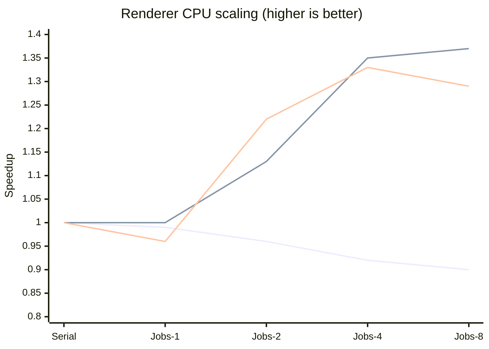

# Phase 3 Parallel CPU Renderer Results

## Environment

- Date: 2026-06-20
- Build: Release, Clang 22.1.8, Windows
- Matrix: 1K/10K/50K objects, Serial and Jobs 1/2/4/8 workers
- Sampling: 5 warmup + 20 measured iterations per case
- Raw data: `scaling.json`, schema 1, render hash version 1

## Correctness

全部 15 个配置的 Visible/Packet/Batch/Draw Input Hash 均与对应 Serial oracle 一致。完整引擎 `instance-10k/jobs/4` smoke 同样实际进入 Jobs 路径，未触发 fallback。

## Total Preparation

单位为 ms；Speedup 使用同对象数 Serial p50 计算。

| Objects | Mode | Workers | p50 | p95 | p99 | Speedup |
| ---: | --- | ---: | ---: | ---: | ---: | ---: |
| 1K | Serial | 0 | 0.3762 | 0.3919 | 0.4208 | 1.00x |
| 1K | Jobs | 1 | 0.3788 | 0.4127 | 0.4608 | 0.99x |
| 1K | Jobs | 2 | 0.3899 | 0.5011 | 0.5830 | 0.96x |
| 1K | Jobs | 4 | 0.4072 | 0.4585 | 0.5650 | 0.92x |
| 1K | Jobs | 8 | 0.4188 | 0.5534 | 0.5722 | 0.90x |
| 10K | Serial | 0 | 3.8690 | 4.0927 | 4.2016 | 1.00x |
| 10K | Jobs | 1 | 3.8883 | 5.0420 | 5.1504 | 1.00x |
| 10K | Jobs | 2 | 3.4221 | 3.7564 | 9.3226 | 1.13x |
| 10K | Jobs | 4 | 2.8722 | 3.2489 | 3.2958 | 1.35x |
| 10K | Jobs | 8 | 2.8271 | 3.0272 | 3.0512 | 1.37x |
| 50K | Serial | 0 | 20.4521 | 21.6320 | 22.5772 | 1.00x |
| 50K | Jobs | 1 | 21.2637 | 23.2725 | 24.2742 | 0.96x |
| 50K | Jobs | 2 | 16.7464 | 19.6937 | 19.9543 | 1.22x |
| 50K | Jobs | 4 | 15.4155 | 16.6772 | 17.5259 | 1.33x |
| 50K | Jobs | 8 | 15.8394 | 17.6737 | 17.9013 | 1.29x |



曲线依次为 1K、10K、50K。1K 证明调度不应无条件开启；10K/50K 开始获益，50K 在 8 Worker 回落，表明串行 merge/Batch、透明排序和阶段屏障已经限制扩展。

## Layout Cost

| Objects | Legacy snapshot visibility p50 | SceneView build + visibility p50 |
| ---: | ---: | ---: |
| 1K | 0.0067 ms | 0.1167 ms |
| 10K | 0.0484 ms | 0.8413 ms |
| 50K | 0.3454 ms | 3.9756 ms |

SceneView 当前是正确性和线程边界，不是串行优化。下一轮 CPU Renderer 优化应让 RenderWorld 增量维护持久化实例数组，避免每帧分类复制；随后才评估 SoA/SIMD 和 stage fusion。

## Reproduce

```powershell
cmake -S . -B build-phase3 -G Ninja -DCMAKE_BUILD_TYPE=Release -DCHIKA_BUILD_EDITOR=OFF -DCHIKA_BUILD_GAME=OFF -DCHIKA_BUILD_BENCHMARKS=ON
cmake --build build-phase3 --target ChikaRenderCpuBenchmark
.\build-phase3\bin\ChikaRenderCpuBenchmark.exe --warmup 5 --samples 20 --output docs\dev\results\cpu-renderer\scaling.json
```
