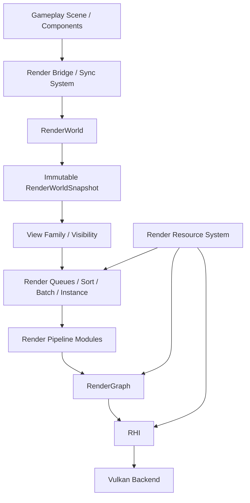

# Renderer 架构升级路线图

## Metadata

- Date: 2026-06-12
- Area: Runtime/Render/Resource/RHI/Asset/Framework/Editor
- Related files:
  - `engine/Runtime/Render/`
  - `engine/Runtime/RHI/`
  - `engine/Runtime/Resource/`
  - `engine/Runtime/Asset/`
  - `engine/Runtime/Framework/src/subsystem/RenderSubSystem.cpp`
  - `Assets/Shaders/`
  - `Assets/Materials/`
- Status: Planned

## Goal

将当前以 `Renderer` 为中心、由 Gameplay 每帧直接提交绘制命令的实现，逐步升级为具备以下边界的渲染架构：

```text
Gameplay Scene
    -> Render Bridge
    -> RenderWorld / RenderWorldSnapshot
    -> Visibility / Render Queue / Batching
    -> Render Pipeline
    -> RenderGraph
    -> RHI
    -> Vulkan Backend
```

最终支持：

- Gameplay 与 Renderer 解耦的 `RenderWorld`。
- Shader Reflection 驱动的资源布局、材质参数与 Pipeline Layout。
- 剔除、排序、批处理和实例化。
- 可扩展的 RenderGraph 与 RHI。
- PBR、IBL、多光源、透明、阴影和后处理。

本路线图只规划开发方向，不修改任何引擎代码。

## 非目标

- 不在一个步骤中完成渲染器整体重写。
- 不立即引入多线程渲染或独立 Render Thread。
- 不立即支持多个图形 API。
- 不使用 Shader Reflection 在每帧按名称查找资源。
- 不在实现基础边界前直接堆叠 PBR、阴影等效果。

## 当前架构审计

### 当前数据流

```text
Scene::Tick
    -> RenderSubsystem::CollectDrawCommands
        -> 遍历所有 GameObject
        -> ResolveAssets
        -> ResourceManager::UploadMesh / UploadMaterial
        -> 构造 DrawCommand
    -> Renderer::SubmitLight
    -> Renderer::SubmitDrawCommands
    -> Renderer::BuildRenderGraph
    -> Renderer::DrawSceneGeometry
    -> IRHICommandList
    -> VulkanCommandList
```

### 主要问题

#### 1. Gameplay 与 Renderer 之间没有稳定的渲染世界

- `RenderSubsystem` 每帧遍历全部 `GameObject`。
- Gameplay 直接生成并提交 `DrawCommand`。
- `MeshRenderer`、动画、资产解析和 GPU 上传混在收集流程中。
- 没有稳定的 Render Object、Light、View 标识，也没有增量更新机制。
- Renderer 持有 Gameplay 相机裸指针，并自行保存默认相机。

结果是 Renderer 无法独立进行剔除、排序、批处理、Render Thread 快照或多视图渲染。

#### 2. Shader 和 Descriptor 布局被写死

当前硬编码贯穿 Asset、Resource、Render 和 Vulkan RHI：

- Vulkan 固定创建一个全局 Descriptor Set Layout：
  - binding `0-3` 固定为 Uniform Buffer。
  - binding `4-15` 固定为 Combined Image Sampler。
- Pipeline Layout 固定只有一个 Descriptor Set，并固定声明 `128` 字节 Push Constant。
- `VulkanCommandList::BindResources` 固定把所有 Buffer 当作 Uniform Buffer，所有 Texture 当作 Combined Image Sampler。
- Renderer 直接使用 binding `1/2/4/5/6`。
- Material Template 需要手工填写 texture slot。
- `ResourceManager` 按参数名字典序自行打包 Material UBO，没有使用 SPIR-V 中的真实成员 offset。
- 顶点布局、GBuffer Shader、Attachment Format 和 Pipeline 创建逻辑均在 `ResourceManager` 中写死。

这些设计会导致 Shader 声明、CPU 数据布局和 Vulkan Pipeline Layout 之间出现静默不一致。

#### 3. Renderer 职责过多

当前 `Renderer` 同时负责：

- RHI 设备生命周期。
- ResourceManager 生命周期。
- RenderGraph 创建与执行。
- 相机和单方向光状态。
- Forward、Deferred、Shadow、Upload、ImGui Pass。
- GBuffer、Shadow、Depth、Offscreen 资源。
- Draw Command 队列与逐对象绘制。
- Resize 与窗口交换链协作。

继续增加 PBR、透明、后处理和多光源会使该类快速失控。

#### 4. RenderGraph 与 RHI 能力不足

- RenderGraph 只支持 Texture，不支持 Buffer。
- 只有 Graphics、Upload、Present Pass，没有 Compute 和 Copy Pass。
- Imported Resource 没有明确的 initial/final state。
- 状态模型缺少 Storage、Indirect、Vertex、Index、Copy Source 等状态。
- 没有 Buffer Barrier、Subresource、Queue Ownership 或资源视图。
- Transient Texture Hash 未覆盖所有兼容性字段。
- 缺少 Graph Dump、Pass Profiling 和资源生命周期可视化。
- RHI 缺少 Compute Pipeline、Dispatch、Indirect Draw、独立 Sampler 和 Storage Binding。

## 目标架构



### 边界定义

- **Gameplay**：保存创作对象、组件、Transform 和资产引用，不持有 Vulkan/RHI 资源。
- **Render Bridge**：把 Gameplay 的新增、删除和 Dirty 状态同步到 RenderWorld。
- **RenderWorld**：保存 Renderer 所需的稳定代理数据，不访问 GameObject。
- **RenderWorldSnapshot**：某一帧可安全消费的只读渲染输入，为未来 Render Thread 做准备。
- **Visibility / Render Queue**：根据 View 进行剔除、分类、排序和批处理。
- **Render Pipeline**：组织 Shadow、Depth、Opaque、Transparent、Lighting、PostProcess 等 Pass。
- **RenderGraph**：声明和编译 Pass/Resource 依赖，不理解 Gameplay 或材质创作逻辑。
- **RHI**：提供后端无关的资源、Pipeline、Binding 和 Command 接口。
- **Vulkan Backend**：只把 RHI 描述翻译成 Vulkan 对象与命令。

## Shader Reflection 设计原则

Shader Reflection 是本次升级的基础任务，不应等到 PBR 阶段再补。

### Reflection 负责什么

- 从编译后的 SPIR-V 提取：
  - Descriptor Set、Binding、Descriptor Type、Array Count。
  - Shader Stage。
  - Uniform/Storage Block 大小、成员 offset 和成员类型。
  - Push Constant Range。
  - Vertex Input。
  - Fragment Output。
  - Entry Point。
- 合并多个 Shader Stage 的接口并检查冲突。
- 驱动 Pipeline Layout、Descriptor Set Layout 和 Material Parameter Layout。
- 在资产导入或 Pipeline 创建阶段进行验证。

### Reflection 不负责什么

- 不在每帧通过字符串查找 binding。
- 不替代材质默认值、编辑器显示名称和参数语义。
- 不取消引擎级资源频率约定。

建议保留以下逻辑约定，但由 Reflection 校验，而不是由 Vulkan 后端写死：

```text
Set 0: Frame / View
Set 1: Material
Set 2: Object / Instance
Set 3: Pass-local Resources
```

这些 Set 号属于引擎策略；Descriptor 类型、Binding 和布局必须来自 Shader Interface。

### Reflection 实现建议

优先使用 Khronos `SPIRV-Reflect`：

- 目标单一，适合从 SPIR-V 获取 Descriptor、Push Constant 和输入输出信息。
- 比自行解析 SPIR-V 更可靠。
- 相比完整 Shader Cross Compilation 工具，依赖面较小。

只有未来需要跨语言转换或 Metal/D3D Shader 生成时，再评估 `SPIRV-Cross`。引入依赖前应单独记录设计决策，不修改现有第三方目录中的代码。

## 分步实施计划

每一步都应保持工程可构建、现有 Forward/Deferred 示例至少有一条可运行路径，并增加对应验证。

---

## Phase 0：建立升级基线

**状态：已完成（2026-06-13）**

- Step 0.1 实现与验证记录：`docs/render/renderer-step-0.1-baseline.dev.md`
- Step 0.2 实现与验证记录：`docs/render/renderer-step-0.2-diagnostics.dev.md`

### Step 0.1：冻结渲染契约与基准场景

**修改范围**

- 新增 Renderer 架构契约文档。
- 在 `tests/` 增加 Render 数据结构和 RenderGraph 的最小测试入口。
- 准备固定测试场景：静态物体、蒙皮物体、多材质物体、透明物体占位。

**交付物**

- 当前 Forward/Deferred 输出基线截图或可重复验证记录。
- Draw Call、Pipeline Bind、Descriptor Update 数量的基线统计。
- Renderer 升级期间必须保持的最小行为清单。

**实现能力**

- 后续每一步都能判断是否发生行为回退或性能退化。

**为什么**

- 当前渲染测试几乎为空，直接重构 Shader Binding、RenderWorld 和 RenderGraph 风险过高。

**完成标准**

- CI 或本地测试能验证 RenderGraph 编译顺序与基础 Render 数据结构。
- Editor 能稳定运行基准场景。

### Step 0.2：增加渲染诊断与命名

**修改范围**

- 为 RHI Resource、Pipeline、Command List 增加 Debug Name 接口。
- Vulkan 后端接入 Debug Utils Label。
- Renderer 收集基础帧统计。

**交付物**

- 可读的 Validation Layer 日志。
- 每帧 Draw、Instance、Pipeline Bind、Descriptor Update、Pass 数量统计。

**实现能力**

- 后续优化排序、批处理和实例化时能量化结果。

**为什么**

- 没有统计和 GPU 调试名称时，很难判断架构升级是否真正减少状态切换。

**完成标准**

- RenderDoc/Validation 日志中能看到具名 Pass 和 Resource。

---

## Phase 1：使用 Shader Reflection 移除硬编码布局

**状态：已完成（2026-06-13）**

- Step 1.1：`docs/render/renderer-step-1.1-shader-interface.dev.md`
- Step 1.2：`docs/render/renderer-step-1.2-shader-reflection-import.dev.md`
- Step 1.3：`docs/render/renderer-step-1.3-program-interface.dev.md`
- Step 1.4：`docs/render/renderer-step-1.4-rhi-layout.dev.md`
- Step 1.5：`docs/render/renderer-step-1.5-vulkan-layout-cache.dev.md`
- Step 1.6：`docs/render/renderer-step-1.6-descriptor-binding.dev.md`
- Step 1.7：`docs/render/renderer-step-1.7-material-layout.dev.md`
- Step 1.8：`docs/render/renderer-step-1.8-remove-legacy-binding.dev.md`

### Step 1.1：定义后端无关的 Shader Interface 数据模型

**修改范围**

- 在 Asset 或独立 Shader 模块中定义：
  - `ShaderReflectionData`
  - `ShaderResourceBinding`
  - `ShaderBufferLayout`
  - `ShaderBufferMember`
  - `ShaderPushConstantRange`
  - `ShaderVertexInput`
  - `ShaderFragmentOutput`
- 为 Descriptor Type 和 Shader Stage Mask 建立后端无关枚举。

**交付物**

- 可序列化、可比较、可 Hash 的 Shader Interface 描述。
- 单元测试覆盖布局排序、Hash 稳定性和冲突判断。

**实现能力**

- Shader 接口不再依赖 Vulkan 类型，也不再只存在于 Shader 源码中。

**为什么**

- Reflection 结果必须先形成稳定契约，RHI 和 Material 才能共同消费。

**完成标准**

- 数据模型能完整表达当前 `test.vert/test.frag/skinned.vert/gbuffer.frag` 的接口。

### Step 1.2：在资产导入阶段提取并持久化 Reflection

**修改范围**

- 扩展 Shader Importer，在 GLSL 编译为 SPIR-V 后执行 Reflection。
- Reflection 数据作为导入产物的一部分保存，不为 `.spv` 或 Reflection 文件创建新的逻辑资产 GUID。
- 扩展 `ShaderData`，加载 SPIR-V 时同时提供 Reflection。

**交付物**

- Shader 导入产物包含 SPIR-V 和 Reflection 数据。
- Shader 导入失败时给出具体冲突或不支持类型。

**实现能力**

- Runtime 无需重新解析 Shader 源文件即可获得完整接口。

**为什么**

- Reflection 是导入工作，不应在每帧或每次 Draw 时执行。

**完成标准**

- 修改 Shader binding 后重新导入，Reflection 数据同步更新。
- 源 Shader 与编译产物仍保持同一个逻辑资产身份。

### Step 1.3：合并 Shader Stage 接口并进行验证

**修改范围**

- 新增 `ShaderProgramInterface` 或等价结构。
- 合并 Vertex/Fragment 资源、Push Constant、输入输出。
- 检查相同 Set/Binding 的类型、数组长度和 Stage 是否兼容。
- 检查 Vertex Output 与 Fragment Input、Fragment Output 与 Attachment 的一致性。

**交付物**

- Shader Program Interface Builder。
- 清晰的接口冲突错误日志。

**实现能力**

- Pipeline 创建前即可发现 Shader Stage 接口不一致。

**为什么**

- 单独 Reflection 每个 Stage 不足以创建可靠的 Pipeline Layout。

**完成标准**

- 冲突 Shader 无法创建 Pipeline，并明确指出冲突位置。

### Step 1.4：扩展 RHI Pipeline Layout 与 Resource Binding 描述

**修改范围**

- 扩展 `RHIDesc.hpp`，增加：
  - Descriptor Binding/Layout 描述。
  - Push Constant Range 描述。
  - Sampler、Storage Buffer、Storage Image 等类型。
- `PipelineDesc` 接收 Shader Program Interface 或 Pipeline Layout 描述。
- `ResourceBindingGroup` 从“slot + 推测类型”升级为“明确 set/binding/type”。

**交付物**

- 后端无关的 Pipeline Layout API。
- 类型安全的资源绑定描述。

**实现能力**

- RHI 不再假设所有 Buffer 都是 UBO、所有 Texture 都是 Combined Sampler。

**为什么**

- 当前 `BindResources` 无法表达 Storage Buffer、独立 Sampler、Descriptor Array 或多个 Set。

**完成标准**

- RHI API 能描述当前 Shader，并能表达未来 Compute/PBR 所需资源。

### Step 1.5：Vulkan 使用 Reflection 创建并缓存布局

**修改范围**

- 移除 Vulkan 全局固定 Descriptor Set Layout 的 Pipeline 依赖。
- 根据 Pipeline Layout 描述创建：
  - `VkDescriptorSetLayout`
  - `VkPipelineLayout`
  - `VkPushConstantRange`
- 增加 Descriptor Set Layout Cache 和 Pipeline Layout Cache。
- Pipeline 对布局使用显式引用或共享所有权。

**交付物**

- Vulkan Layout Cache。
- 由 Shader Interface 驱动的 Pipeline 创建路径。

**实现能力**

- 不同 Shader 可以拥有不同资源布局和 Push Constant 范围。

**为什么**

- 全局 `0-3 UBO + 4-15 Texture + 128 Push Constant` 是当前最核心的错误边界。

**完成标准**

- Vulkan 后端不再创建或依赖 `m_globalDescriptorLayout`。
- Pipeline Layout 与 Reflection 完全一致。

### Step 1.6：重构 Descriptor 分配与绑定

**修改范围**

- Descriptor Set 根据目标 Layout 分配。
- Descriptor Pool 按实际 Descriptor Type 和需求扩容。
- `BindResources` 校验 set、binding、类型和数组长度。
- 区分每帧临时 Descriptor 与可缓存的 Material Descriptor。

**交付物**

- Layout-aware Descriptor Allocator。
- Descriptor Write Cache 或 Material Descriptor Cache。

**实现能力**

- 避免每个 Draw 都盲目分配并更新完整 Descriptor Set。
- 支持多个 Descriptor Set 和更多 Descriptor 类型。

**为什么**

- 当前每次 Draw 都分配临时 Set，无法有效批处理，也无法保证绑定类型正确。

**完成标准**

- 相同 Material 的静态 Descriptor 可以跨 Draw 复用。
- Validation Layer 不出现布局或 Descriptor 类型错误。

### Step 1.7：使用 Reflection 驱动 Material Parameter Layout

**修改范围**

- Material UBO 按 Reflection 提供的 block size、member offset 和类型写入。
- Shader Template 不再保存手工 texture slot。
- Shader Template 只保存：
  - 默认值。
  - 编辑器显示信息。
  - 参数语义。
  - Variant/Feature 规则。
- 参数名称在 Material 创建阶段解析为稳定 Parameter ID 或 Binding Handle。

**交付物**

- Reflection 驱动的 `MaterialParameterLayout`。
- Material Template 新格式与迁移说明。

**实现能力**

- CPU 材质数据与 Shader 内存布局严格一致。
- Shader 改 binding 或成员顺序后不需要同步修改 C++ slot。

**为什么**

- 当前按名字典序打包 UBO 与 Shader 实际 offset 没有可靠关系。

**完成标准**

- `ResourceManager` 不再手工计算 Material UBO 成员顺序。
- Material JSON 中不再出现资源 slot。

### Step 1.8：删除旧硬编码绑定路径

**修改范围**

- 删除 Renderer 中直接使用的 binding `1/2/4/5/6`。
- 删除 Vulkan 固定 Push Constant 范围与全局 Layout。
- 删除手工材质 slot 和旧兼容分支。
- Shader Importer 增加引擎 Set 频率约定校验。

**交付物**

- 完整 Reflection Binding 路径。
- Shader Interface 与 Material Binding 测试。

**实现能力**

- Shader、Material、Pipeline 和 Descriptor 的布局来源统一。

**为什么**

- 保留两条绑定路径会持续制造歧义，并让新功能绕回旧设计。

**完成标准**

- 搜索代码不再出现以数字常量表达业务 binding 的 Renderer/Resource 绑定代码。

---

## Phase 2：拆分 Renderer 并建立 RenderWorld

### Step 2.1：将 Renderer 收缩为 Facade

**修改范围**

- 保留 `Renderer` 作为生命周期和高层入口。
- 从 Renderer 拆出：
  - `RenderDeviceContext`：RHI 与帧生命周期。
  - `RenderResourceSystem`：GPU Resource 与上传。
  - `RenderPipeline`：Pass 组织。
  - `RenderSettings`：阴影尺寸、Pipeline 模式、质量设置。

**交付物**

- 职责清晰的 Renderer 子系统边界。
- 依赖关系图与生命周期文档。

**实现能力**

- 后续增加 Pass 或资源系统时不继续扩大 `Renderer`。

**为什么**

- 当前 Renderer 已同时承担设备、资源、世界、Pipeline 和 UI 职责。

**完成标准**

- `Renderer` 不再直接保存所有 Pass 专属资源和业务常量。

### Step 2.2：定义 RenderWorld 数据与稳定句柄

**修改范围**

- 新增独立 `RenderWorld`。
- 定义稳定句柄：
  - `RenderObjectHandle`
  - `RenderLightHandle`
  - `RenderViewHandle`
- 定义 Render Proxy：
  - Transform。
  - Mesh/Material Render Resource。
  - Bounds。
  - Visibility Flags、Layer Mask。
  - Shadow/Transparency/Skinned Flags。

**交付物**

- 不依赖 GameObject 的 RenderWorld 数据模型。
- RenderWorld 创建、更新、删除测试。

**实现能力**

- Renderer 可独立管理稳定的渲染对象。

**为什么**

- 剔除、排序、批处理和 Render Thread 都不能直接建立在 GameObject 指针上。

**完成标准**

- RenderWorld 公共接口不包含 `Scene`、`GameObject` 或 `Component` 类型。

### Step 2.3：建立 Gameplay 到 RenderWorld 的增量同步

**修改范围**

- 将 `RenderSubsystem::CollectDrawCommands` 改造为 Render Bridge。
- `MeshRenderer` 在创建、启用、Dirty、禁用、销毁时同步 Render Proxy。
- Transform、材质、Mesh、动画状态变化只更新对应代理。
- Gameplay 组件不再持有 RHI Buffer Handle。

**交付物**

- Gameplay 生命周期到 RenderWorld 生命周期的映射。
- Dirty Queue 或 Render Update Command Queue。

**实现能力**

- 避免每帧遍历所有 GameObject 和重复 Resolve/Upload。

**为什么**

- 稳定 RenderWorld 必须通过增量同步维护，而不是每帧重新生成全部 DrawCommand。

**完成标准**

- 静止场景连续帧不产生 Render Proxy 更新。
- 删除/禁用对象后，对应代理可靠移除。

### Step 2.4：增加不可变 RenderWorldSnapshot

**修改范围**

- RenderWorld 在帧边界生成只读 Snapshot。
- Renderer 只消费 Snapshot，不直接读取正在更新的 RenderWorld。
- 明确 Snapshot 中静态数据与每帧动态数据的存储方式。

**交付物**

- `RenderWorldSnapshot`。
- Snapshot 一致性和对象删除测试。

**实现能力**

- 为未来 Render Thread、多线程剔除和并行 Pass 构建提供安全输入。

**为什么**

- 即使当前单线程，先建立 Snapshot 边界可以避免后续再次重写 Gameplay/Renderer 接口。

**完成标准**

- Renderer 帧内不访问 Gameplay 或可变 RenderWorld。

### Step 2.5：建立 View Family 与 Light Proxy

**修改范围**

- 相机转换为 Render View 数据，不再由 Renderer 持有 Gameplay Camera 裸指针。
- 单帧可提交多个 View。
- 方向光、点光源、聚光灯统一为 Render Light Proxy。
- 移除 `SubmitLight` 和 Renderer 内置默认光源逻辑。

**交付物**

- `RenderView`、`ViewFamily`、`RenderLightProxy`。
- 主视口、编辑器视口和未来阴影视图可共用的数据模型。

**实现能力**

- 多视图、多光源和 Shadow View 有统一入口。

**为什么**

- 相机和光源属于 RenderWorld 输入，不应作为 Renderer 内部特殊状态。

**完成标准**

- Renderer 可以使用 Snapshot 中的 View 和 Light 完成现有场景渲染。

---

## Phase 3：可见性、排序、批处理与实例化

### Step 3.1：为 Mesh 建立 Bounds

**修改范围**

- Asset Importer 或 Mesh Loader 计算 Local AABB/Bounding Sphere。
- Render Proxy 根据 World Transform 生成 World Bounds。
- Skinned Mesh 初期使用保守 Bounds，后续再支持动态 Bounds。

**交付物**

- Mesh Bounds 数据。
- Transform 后 Bounds 正确性测试。

**实现能力**

- RenderWorld 对象具备可剔除的空间范围。

**为什么**

- 没有 Bounds 就无法进行可靠的 Frustum Culling。

**完成标准**

- 所有可绘制 Render Proxy 都拥有有效 Bounds。

### Step 3.2：实现基于 View 的 Frustum Culling

**修改范围**

- 从 View Projection 提取 Frustum Plane。
- Visibility 阶段对 Render Proxy Bounds 做相交测试。
- 统计 visible/culled object 数量。

**交付物**

- `VisibilityResult`。
- Frustum Culling 单元测试与场景验证。

**实现能力**

- 不向后续阶段提交视锥外物体。

**为什么**

- 剔除应发生在 Render Queue 构建前，否则排序和批处理仍处理无效对象。

**完成标准**

- 移出视锥的静态物体不产生 Draw。

### Step 3.3：建立 Render Packet 与 Pass 分类

**修改范围**

- 将可见 Render Proxy 转换为 Render Packet。
- 按 Opaque、Masked、Transparent、ShadowCaster、Skinned 等分类。
- Render Pipeline 从分类结果构建 Pass，不再使用 `shadowPass/gbufferPass` 布尔分支。

**交付物**

- `RenderPacket` 和分类队列。
- 明确的 Pass Filter/Feature Flags。

**实现能力**

- 一个 Render Proxy 可按需要进入多个 Pass，同时保持 Pass 逻辑独立。

**为什么**

- 当前 `DrawSceneGeometry(bool shadowPass, bool gbufferPass)` 无法扩展到更多 Pass。

**完成标准**

- Forward、GBuffer 和 Shadow 使用独立队列完成现有绘制。

### Step 3.4：实现稳定 Render Sort Key

**修改范围**

- 定义 64-bit 或结构化 Sort Key。
- Opaque 优先按 Pipeline、Material、Mesh 排序。
- Transparent 预留按 View Depth 反向排序。
- Command Recording 缓存当前 Pipeline、Material 和 Mesh 状态。

**交付物**

- Sort Key 规范。
- 排序测试和状态切换统计。

**实现能力**

- 减少 Pipeline Bind、Descriptor Bind 和 Vertex/Index Buffer Bind。

**为什么**

- 当前 Draw Command 按 GameObject 遍历顺序绘制，状态切换不可控。

**完成标准**

- 基准场景中排序后 Pipeline/Material Bind 数量可量化下降。

### Step 3.5：实现批处理

**修改范围**

- 将相同 Pipeline、Material、Mesh 和 Pass 状态的连续 Packet 合并为 Batch。
- Batch 记录共享绑定和 Draw 范围。
- 将 Pass 录制从逐对象绑定改为逐 Batch 绑定。

**交付物**

- `RenderBatch`。
- Batch Builder 和批处理统计。

**实现能力**

- 减少重复资源绑定，为实例化提供直接输入。

**为什么**

- 排序只减少状态变化，Batch 才能形成稳定的共享提交单元。

**完成标准**

- 相同材质和 Mesh 的对象被归入同一 Batch。

### Step 3.6：实现 GPU Instancing

**修改范围**

- 增加 Instance Data Buffer 和每帧 Ring Buffer/Upload Allocator。
- 扩展 RHI Draw API，支持 first instance 等完整参数。
- Reflection 识别 Object/Instance 数据绑定。
- 相同 Mesh/Material Batch 使用一次 Instanced Draw。

**交付物**

- Instance Data Layout。
- Instanced Draw 路径和实例数量统计。

**实现能力**

- 大量重复 Mesh 由多个 Draw 降为单个 Instanced Draw。

**为什么**

- 实例化是批处理的主要 GPU 收益，也是后续场景规模扩展的基础。

**完成标准**

- N 个相同 Mesh/Material 对象产生一个 Draw，`instanceCount == N`。

### Step 3.7：整理动态与蒙皮对象路径

**修改范围**

- 骨骼矩阵从 `MeshRenderer` 持有的 RHI Handle 中移出。
- 使用每帧动态 Buffer 分配或 Storage Buffer。
- 动态对象与静态实例对象使用明确的不同 Batch 策略。

**交付物**

- Skinned Object Data 路径。
- 动态 Buffer 生命周期说明。

**实现能力**

- 蒙皮对象不再破坏 RenderWorld 边界，也不依赖固定 `128` 骨骼 UBO。

**为什么**

- 当前 Gameplay 组件持有 GPU Buffer，且骨骼数量和 binding 均写死。

**完成标准**

- 蒙皮场景通过 RenderWorld Snapshot 渲染，Gameplay 不持有 RHI Handle。

---

## Phase 4：扩展 RenderGraph 与 RHI

### Step 4.1：RenderGraph 支持 Buffer Resource

**修改范围**

- 增加 `RGBufferHandle`、`RGBufferResource`。
- Pass Builder 支持 Create/Import/Read/Write Buffer。
- Buffer 参与依赖分析、生命周期和 transient 分配。

**交付物**

- Texture/Buffer 统一或并行的 RenderGraph Resource 模型。
- Buffer 依赖测试。

**实现能力**

- Instance Buffer、Light Buffer、Indirect Buffer 和 Compute 输出可以进入 RenderGraph。

**为什么**

- 现代渲染管线不能只管理 Texture。

**完成标准**

- 一个 Copy/Compute Pass 写 Buffer，后续 Graphics Pass 能正确读取。

### Step 4.2：完善资源状态与 Barrier 模型

**修改范围**

- 扩展 Resource State：
  - CopySrc/CopyDst。
  - Vertex/Index。
  - Uniform/Storage Read/Write。
  - Indirect Argument。
  - Depth Read/Write。
- 增加 Buffer Barrier。
- Imported Resource 声明 initial/final state。
- 为 Texture 预留 mip/layer subresource 范围。

**交付物**

- 更完整的 RHI Barrier API。
- RenderGraph 自动 Barrier 测试。

**实现能力**

- RenderGraph 可正确连接上传、Compute、Graphics 和 Present。

**为什么**

- 当前状态模型不足以表达 Compute、Indirect 和复杂后处理依赖。

**完成标准**

- Validation Layer 不依赖隐式 `Undefined` 推导完成正常帧。

### Step 4.3：增加 Compute、Copy 与 Depth-only Pass

**修改范围**

- `RGPassType` 增加 Compute 和 Copy。
- Graphics Pass 正式支持无 Color Attachment 的 Depth-only 模式。
- 移除 Shadow Dummy Color Texture。
- Execute 根据 Pass 类型选择正确命令录制路径。

**交付物**

- Compute/Copy/Depth-only Pass API。

**实现能力**

- Shadow、Light Culling、后处理和资源上传不再使用临时绕行设计。

**为什么**

- 当前 Shadow Pass 为适配接口创建 Dummy Color，Upload Pass 也只是特殊分支。

**完成标准**

- Shadow Pass 只写 Depth；Upload 使用 Copy Pass；Compute Pass 可 Dispatch。

### Step 4.4：增强 Transient Resource 与 Graph 编译验证

**修改范围**

- Transient Resource Hash 覆盖 format、extent、mips、layers、usage、sample count 等兼容字段。
- 检查 read-before-write、重复 producer、无效 handle 和不兼容 attachment。
- 支持 aliasing 前先保证生命周期分析正确。

**交付物**

- RenderGraph 编译错误报告。
- Transient Resource 兼容性测试。

**实现能力**

- RenderGraph 资源复用更可靠，错误更早暴露。

**为什么**

- 当前简单 Texture Hash 和最后 producer 模型不足以支撑复杂 Pipeline。

**完成标准**

- 非法 Graph 在 Compile 阶段失败，而不是在 Vulkan Validation 中失败。

### Step 4.5：拆分 Render Pipeline Pass 模块并增加 Blackboard

**修改范围**

- 将 Shadow、GBuffer、Lighting、Transparent、PostProcess、UI 拆成独立 Pass Module。
- 增加 RenderGraph Blackboard，用具名语义传递 SceneColor、Depth、GBuffer 等资源。
- Renderer 不再直接保存所有 RG Handle。

**交付物**

- 可组合的 Render Pipeline 模块。
- Pass 输入输出契约。

**实现能力**

- Forward、Deferred 和未来 Debug Pipeline 可以组合不同 Pass。

**为什么**

- 当前全部 Pass 都写在 `renderer.cpp`，难以测试、复用和独立演进。

**完成标准**

- 新增一个 Pass 不需要修改 Renderer 核心状态结构。

### Step 4.6：增加 RenderGraph 调试和性能查询

**修改范围**

- RenderGraph 输出 Pass DAG、资源生命周期和 Barrier。
- RHI 增加 Timestamp Query 与 Pass Debug Label。
- Editor 增加简单 RenderGraph/Frame Stats 面板。

**交付物**

- Graph Dump。
- 每 Pass CPU/GPU 时间与资源查看入口。

**实现能力**

- 可定位无效 Pass、资源生命周期错误和 GPU 瓶颈。

**为什么**

- PBR、多光源、阴影和后处理会快速增加 Pass 数量，必须具备可观测性。

**完成标准**

- 能查看一帧内的 Pass 顺序、资源依赖和 GPU 时间。

### Step 4.7：补齐高级 RHI 能力

**修改范围**

- 增加 Compute Pipeline 和 Dispatch。
- 增加完整 Draw/DrawIndexed 参数和 Indirect Draw。
- 增加独立 Sampler、Resource View、Descriptor Array。
- 完整实现 Storage Buffer 使用与绑定。
- 明确 Frame Upload Allocator 和资源销毁时序。

**交付物**

- 高级渲染功能所需的 RHI 最小能力集。

**实现能力**

- 支持 Clustered Light、GPU Culling、后处理和更灵活的材质资源。

**为什么**

- 不能让高级渲染功能直接绕过 RHI 调用 Vulkan。

**完成标准**

- Render Pipeline 层不包含 Vulkan 类型或 Vulkan 特化逻辑。

---

## Phase 5：实现成熟渲染功能

### Step 5.1：建立 HDR 与颜色空间基础

**修改范围**

- Scene Color 使用 HDR Format。
- 明确 Texture sRGB/Linear 属性和采样规则。
- 增加曝光与 Tone Mapping 占位 Pass。

**交付物**

- HDR Scene Color Pipeline。
- 颜色空间规范。

**实现能力**

- PBR 光照和后处理有正确的颜色基础。

**为什么**

- 在 LDR 和未定义颜色空间上实现 PBR 会产生错误结果。

**完成标准**

- Scene 在线性 HDR 空间计算，输出阶段转换到显示空间。

### Step 5.2：实现基础 Metallic-Roughness PBR

**修改范围**

- 定义标准 PBR Material 参数：
  - Base Color。
  - Metallic。
  - Roughness。
  - Normal。
  - Emissive。
  - Occlusion。
- 实现基础 BRDF，并先支持单方向光。
- 调整 GBuffer 以保存 PBR 所需数据。

**交付物**

- PBR Material Template 与 Shader。
- 标准材质测试球场景。

**实现能力**

- 以统一材质模型替代当前基础方向光模型。

**为什么**

- 先用单光源验证 BRDF，能把材质正确性与多光源架构问题分离。

**完成标准**

- Metallic/Roughness 极值和法线贴图表现符合预期。

### Step 5.3：增加 Image-Based Lighting

**修改范围**

- 导入或生成 Irradiance Map、Prefiltered Environment Map 和 BRDF LUT。
- RenderGraph 增加必要的预计算或加载流程。
- PBR Shader 接入环境光照。

**交付物**

- IBL 资源与运行时绑定路径。

**实现能力**

- PBR 材质在无直接光时仍有合理环境响应。

**为什么**

- 只有直接光的 PBR 不完整，金属材质尤其明显。

**完成标准**

- 材质测试球能正确反映不同 Roughness 下的环境响应。

### Step 5.4：实现多光源与可扩展 Light Culling

**修改范围**

- RenderWorld 支持方向光、点光源和聚光灯。
- Light 数据上传到 Structured/Storage Buffer。
- 先实现正确的多光源循环，再升级为 Tiled/Clustered Light Culling。
- Compute Pass 生成每 Tile/Cluster 的 Light List。

**交付物**

- 多光源数据结构。
- Light Culling Compute Pass。

**实现能力**

- 场景可包含大量局部光源，而不是固定单方向光。

**为什么**

- 先保证正确性，再增加 Clustered 优化，可以降低调试复杂度。

**完成标准**

- 多种光源可同时影响场景；大量局部光源不会线性增加所有像素的计算量。

### Step 5.5：实现透明渲染路径

**修改范围**

- Material 增加 Blend Mode、Depth Write、Cull 等渲染状态。
- Transparent Packet 进入独立队列。
- 按 View Depth 从远到近排序。
- 透明 Pass 在 Opaque Lighting 后执行。

**交付物**

- Transparent Render Queue 和 Pipeline。

**实现能力**

- 支持基础 Alpha Blend 透明材质。

**为什么**

- 透明物体不能使用与 Opaque 相同的排序、深度写入和 Deferred 路径。

**完成标准**

- 多层透明对象按预期混合，且不污染 GBuffer。

### Step 5.6：实现阴影系统

**修改范围**

- 将当前固定单张 Shadow Map 升级为 Shadow System。
- 方向光先实现 Cascaded Shadow Maps。
- 增加 Shadow Atlas 和 Shadow View。
- 点光源/聚光灯阴影作为后续增量。
- 增加 Bias、PCF 和质量设置。

**交付物**

- Shadow View/Atlas 管理。
- Directional CSM。
- Shadow Settings。

**实现能力**

- 多 View、多级联、可配置质量的阴影。

**为什么**

- 当前固定 `2048x2048` Shadow Map、单光源和 Dummy Color 无法扩展。

**完成标准**

- 主方向光支持稳定 CSM；阴影资源由 RenderGraph 管理。

### Step 5.7：建立后处理链

**修改范围**

- 增加 PostProcess Pipeline 和可组合 Pass。
- 第一阶段实现 Tone Mapping、Gamma、Bloom、FXAA。
- TAA、Motion Blur、SSAO 等在 Motion Vector/History Resource 完成后再实现。
- RenderGraph 管理 History 和 Ping-Pong Resource。

**交付物**

- 可组合 PostProcess Stack。
- 基础后处理效果与配置。

**实现能力**

- 渲染结果经过统一输出流程，后处理效果可按配置启用。

**为什么**

- 后处理必须建立在 HDR、RenderGraph 资源管理和独立 Pass 模块之上。

**完成标准**

- 后处理效果可单独开关，关闭时不创建无用 Pass。

### Step 5.8：建立渲染质量与性能回归体系

**修改范围**

- 增加固定相机截图对比或离线渲染验证。
- 增加不同规模场景的 Draw、Instance、Descriptor 和 GPU 时间预算。
- Validation Layer 和资源泄漏检查纳入常规验证。

**交付物**

- Render Feature Matrix。
- 图像回归与性能回归记录。

**实现能力**

- 后续继续增加效果时能控制正确性与性能退化。

**为什么**

- 成熟 Renderer 的关键不是功能数量，而是功能可验证、可观测、可维护。

**完成标准**

- PBR、多光源、透明、阴影和后处理都有固定验证场景。

## 推荐实施顺序与里程碑

### Milestone A：可靠的 Shader/Pipeline 契约

包含：

- Step 0.1 - 0.2
- Step 1.1 - 1.8

完成后：

- 不再存在固定全局 Descriptor Layout。
- Material 不再手工维护 slot 和 UBO offset。
- Pipeline Layout 完全由 Shader Interface 驱动。

这是后续所有 Renderer 工作的前置条件。

### Milestone B：独立 RenderWorld 与可扩展提交

包含：

- Step 2.1 - 2.5
- Step 3.1 - 3.7

完成后：

- Renderer 不再读取 Gameplay 对象。
- 支持剔除、分类、排序、批处理和实例化。
- 为 Render Thread 与大场景提交建立数据边界。

### Milestone C：现代 RenderGraph/RHI

包含：

- Step 4.1 - 4.7

完成后：

- RenderGraph 可以管理 Buffer、Compute、Copy、Depth-only 和复杂资源状态。
- RHI 足以支撑高级渲染功能，而无需直接调用 Vulkan。

### Milestone D：完整画面能力

包含：

- Step 5.1 - 5.8

完成后：

- 具备 HDR、PBR、IBL、多光源、透明、阴影和后处理。
- 具备基本的质量与性能回归体系。

## 不应采用的实现方式

- 不应继续在 Renderer 中增加新的固定 binding 数字。
- 不应让 Vulkan Backend 根据 binding 数字猜测 Descriptor Type。
- 不应在运行时每帧执行 Shader Reflection 或字符串绑定查找。
- 不应让 Gameplay Component 保存 RHI/Vulkan Handle。
- 不应在没有 RenderWorld 的情况下继续扩充 `DrawCommand`。
- 不应直接在 Renderer 主类中继续添加所有 Pass。
- 不应为了快速实现效果绕过 RenderGraph/RHI 调用 Vulkan。
- 不应在剔除、排序和统计完成前宣称批处理或实例化已经有效。

## 每一步统一记录要求

每完成一个步骤，应在 `docs/render/` 新增对应开发记录，至少包含：

- 本步骤目标与边界。
- 修改文件和公共 API 变化。
- 旧路径如何迁移或删除。
- 自动测试、运行验证与 Validation Layer 结果。
- Draw/Bind/Descriptor/Pass 数量变化。
- 尚未解决的问题和下一步骤。

文件命名建议：

```text
docs/render/renderer-step-0.1-baseline.dev.md
docs/render/renderer-step-1.1-shader-interface.dev.md
docs/render/renderer-step-1.2-shader-reflection-import.dev.md
docs/render/renderer-step-2.2-render-world.dev.md
docs/render/renderer-step-3.6-instancing.dev.md
```
